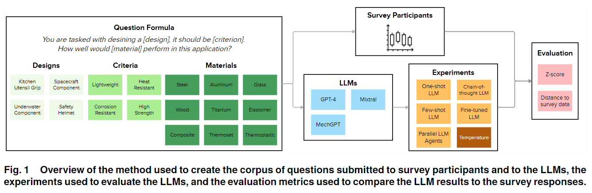

# Evaluating Large Language Models for Material Selection
[📄 Paper link](https://arxiv.org/abs/2405.03695)

[🧊 Demo website](https://material-selection-llms.streamlit.app/)



## Abstract
Material selection is a crucial step in conceptual design due to its significant impact on the functionality, aesthetics, manufacturability, and sustainability impact of the final product. This study investigates the use of Large Language Models (LLMs) for material selection in the product design process and compares the performance of LLMs against expert choices for various design scenarios. By collecting a dataset of expert material preferences, the study provides a basis for evaluating how well LLMs can align with expert recommendations through prompt engineering and hyperparameter tuning.

The divergence between LLM and expert recommendations is measured across different model configurations, prompt strategies, and temperature settings. This approach allows for a detailed analysis of factors influencing the LLMs' effectiveness in recommending materials.
The results from this study highlight two failure modes, and identify parallel prompting as a useful prompt-engineering method when using LLMs for material selection. The findings further suggest that, while LLMs can provide valuable assistance, their recommendations often vary significantly from those of human experts. This discrepancy underscores the need for further research into how LLMs can be better tailored to replicate expert decision-making in material selection.

This work contributes to the growing body of knowledge on how LLMs can be integrated into the design process, offering insights into their current limitations and potential for future improvements.
## Repository
```
📦 LLM-for-Material-Selection
├─ data  # Data from the survey responses
├─ evaluation  # Scripts used to evaluate the results
└─ generation  # Scripts used to generate the results
```

## Installation
```bash
pip install tqdm pandas replicate llama-index llama-index-llms-replicate notebook seaborn matplotlib chardet
```

The code currently requires OpenAI and Replicate API keys, but can be modified to work with any model.

For MeLM installation, please refer to the original repository [here](https://github.com/lamm-mit/MeLM).
