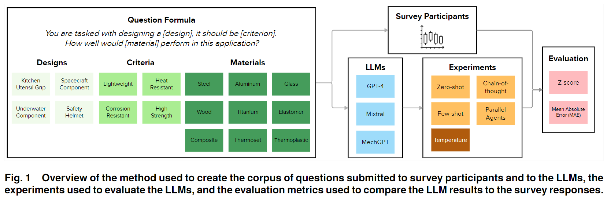

# Evaluating Large Language Models for Material Selection
JCISE publication



## Abstract

## Tree
```
📦 LLM-for-Material-Selection
├─ data  # Data from the survey responses
├─ evaluation  # Scripts used to evaluate the results
└─ generation  # Scripts used to generate the results
```

## Installation
```bash
pip install tqdm pandas replicate llama-index llama-index-llms-replicate notebook seaborn matplotlib
```

The code currently requires OpenAI and Replicate API keys, but can be modified to work with any model.

For MeLM installation, please refer to the original repository [here](https://github.com/lamm-mit/MeLM).